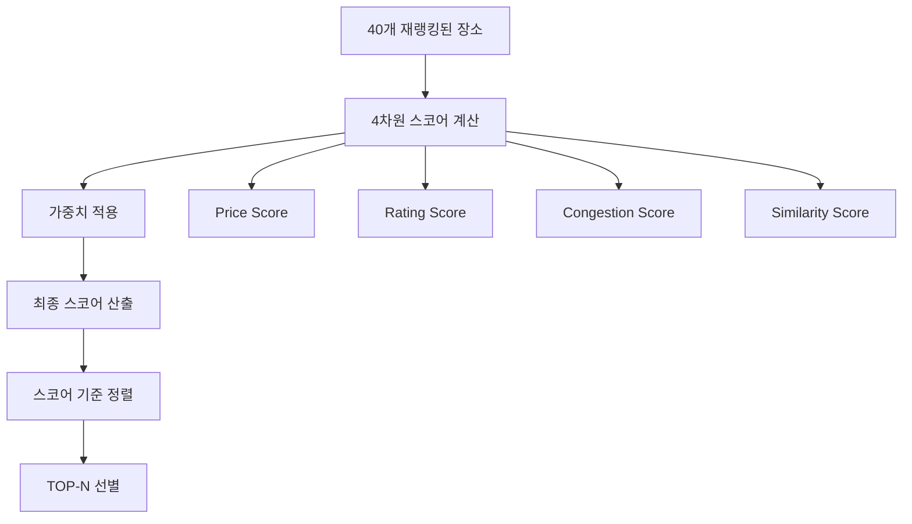

# 🏆 스코어링 시스템 (Scoring System)

## Overview

여행 추천 시스템의 **Step 3-7**에서 사용되는 다차원 스코어링 시스템입니다.
LLM 재랭킹을 통해 선별된 40개 장소를 최종적으로 TOP-N개로 압축하는 핵심 로직입니다.

## 스코어링 파이프라인



---

## 4차원 스코어링 시스템

### 1. 💰 Price Score (가격 스코어)

**사용자 예산과 장소 가격대의 적합도 측정**

#### 가격 레벨 매핑

```python
price_ranges = {
    1: (0, 30000),      # 격안: ~3만원
    2: (20000, 80000),  # 중급: 2~8만원
    3: (60000, 150000), # 고급: 6~15만원
    4: (120000, 300000) # 최고급: 12~30만원
}
```

#### 계산 로직

```python
def calculate_price_score(spot_price_level, user_budget):
    min_price, max_price = price_ranges[spot_price_level]
    avg_price = (min_price + max_price) / 2

    if user_budget >= avg_price:
        # 예산 내 → 높은 스코어
        score = min(1.0, user_budget / avg_price * 0.8)
    else:
        # 예산 초과 → 낮은 스코어
        score = user_budget / avg_price

    return max(0.0, min(1.0, score))
```

#### 예시

-   사용자 예산: 50,000원
-   장소 가격대: 2 (중급, 평균 50,000원)
-   **Price Score: 0.8** ✅

---

### 2. ⭐ Rating Score (평점 스코어)

**Google 평점과 리뷰 신뢰도 기반 품질 측정**

#### 계산 공식

```python
def calculate_rating_score(rating, ratings_total):
    # 기본 평점 스코어 (5점 만점 → 1점 만점)
    base_score = rating / 5.0

    # 신뢰도 보너스 (리뷰 수 기반)
    if ratings_total >= 1000:
        reliability_bonus = 0.2     # 매우 신뢰
    elif ratings_total >= 100:
        reliability_bonus = 0.1     # 신뢰
    elif ratings_total >= 10:
        reliability_bonus = 0.05    # 보통
    else:
        reliability_bonus = 0.0     # 낮음

    final_score = base_score + reliability_bonus
    return max(0.0, min(1.0, final_score))
```

#### 예시

-   평점: 4.2/5.0
-   리뷰 수: 1,234개
-   기본 스코어: 0.84
-   신뢰도 보너스: 0.2
-   **Rating Score: 1.0** ✅

---

### 3. 👥 Congestion Score (혼잡도 스코어)

**사용자 선호 분위기와 장소 혼잡도의 매칭도 측정**

#### 분위기별 선호 인기도

```python
atmosphere_preferences = {
    "조용한": 0.2,    # 조용한 분위기 → 낮은 인기도 선호
    "평범한": 0.6,    # 평범한 분위기 → 보통 인기도 선호
    "활기찬": 1.0,    # 활기찬 분위기 → 높은 인기도 선호
    "로맨틱한": 0.4   # 로맨틱한 분위기 → 적당한 인기도 선호
}
```

#### 인기도 레벨 계산

```python
def calculate_popularity_level(ratings_total):
    if ratings_total >= 1000:
        return 1.0      # 매우 인기
    elif ratings_total >= 500:
        return 0.8      # 인기
    elif ratings_total >= 100:
        return 0.6      # 보통
    elif ratings_total >= 50:
        return 0.4      # 조용
    else:
        return 0.2      # 매우 조용
```

#### 매칭 스코어 계산

```python
def calculate_congestion_score(atmosphere, ratings_total):
    preferred_popularity = atmosphere_preferences[atmosphere]
    actual_popularity = calculate_popularity_level(ratings_total)

    # 선호도와 실제 인기도의 차이를 스코어로 변환
    score = 1.0 - abs(preferred_popularity - actual_popularity)
    return max(0.0, min(1.0, score))
```

#### 예시

-   사용자 분위기: "조용한" (선호 인기도: 0.2)
-   장소 리뷰 수: 45개 (실제 인기도: 0.2)
-   차이: |0.2 - 0.2| = 0.0
-   **Congestion Score: 1.0** ✅

---

### 4. 🎯 Similarity Score (유사도 스코어)

**Vector Search에서 계산된 의미적 유사도 직접 활용**

```python
def calculate_similarity_score(spot):
    # Vector Search에서 이미 계산된 값 사용
    similarity_score = spot.get("similarity_score", 0.5)
    return max(0.0, min(1.0, similarity_score))
```

---

## 가중치 적용 및 최종 스코어

### 가중치 구조

```python
default_weights = {
    "price": 0.25,      # 25% - 가격 적합도
    "rating": 0.35,     # 35% - 품질 신뢰도
    "congestion": 0.25, # 25% - 분위기 매칭
    "similarity": 0.15  # 15% - 의미적 유사도
}
```

### 최종 스코어 계산

```python
def calculate_final_score(scores, weights):
    final_score = (
        scores["price"] * weights["price"] +
        scores["rating"] * weights["rating"] +
        scores["congestion"] * weights["congestion"] +
        scores["similarity"] * weights["similarity"]
    )
    return final_score
```

---

## 실제 계산 예시

### 예시 장소: "조용한 카페"

```python
# 입력 데이터
spot = {
    "name": "조용한 카페",
    "rating": 4.2,
    "ratings_total": 89,
    "price_level": 2,
    "similarity_score": 0.85
}

user_data = {
    "budget": 50000,
    "atmosphere": "조용한"
}

weights = {
    "price": 0.3,
    "rating": 0.3,
    "congestion": 0.3,
    "similarity": 0.1
}

# 스코어 계산
scores = {
    "price": 0.8,      # 예산 적합
    "rating": 0.89,    # 4.2/5 + 0.05 보너스
    "congestion": 0.8, # 조용한 분위기 매칭
    "similarity": 0.85 # Vector Search 결과
}

# 최종 스코어
final_score = (0.8 * 0.3) + (0.89 * 0.3) + (0.8 * 0.3) + (0.85 * 0.1)
            = 0.24 + 0.267 + 0.24 + 0.085
            = 0.832
```

---

## 특별 기능

### 1. 스코어 디버깅 정보

각 장소에 추가되는 메타데이터:

```python
spot_with_score = {
    # 기존 장소 정보...
    "final_score": 0.832,
    "score_breakdown": {
        "price": 0.8,
        "rating": 0.89,
        "congestion": 0.8,
        "similarity": 0.85
    },
    "weights_used": {
        "price": 0.3,
        "rating": 0.3,
        "congestion": 0.3,
        "similarity": 0.1
    }
}
```

### 2. 동적 가중치 조정

LLM 재랭킹 단계에서 사용자 프로필에 따라 가중치가 동적으로 조정됩니다:

#### 예산 제약이 강한 경우

```python
adjusted_weights = {
    "price": 0.45,     # 가격 중요도 증가
    "rating": 0.25,
    "congestion": 0.20,
    "similarity": 0.10
}
```

#### 분위기를 매우 중시하는 경우

```python
adjusted_weights = {
    "price": 0.20,
    "rating": 0.25,
    "congestion": 0.40, # 혼잡도(분위기) 중요도 증가
    "similarity": 0.15
}
```

---

## 성능 최적화

### 1. 에러 처리

-   모든 스코어 계산에서 안전한 타입 변환
-   기본값 fallback 제공
-   예외 발생 시 중립값(0.5) 반환

### 2. 로깅 시스템

```python
print(f"🏆 최종스코어링 시작: {len(spots)}개 → TOP-{top_n}")
print(f"⚖️ 사용 가중치: {weights}")
print(f"🥇 최고 스코어: {top_spots[0]['final_score']:.3f}")
```

### 3. 범위 제한

-   모든 스코어는 0.0 ~ 1.0 범위로 정규화
-   가중치 합계가 1.0이 되도록 보장
-   수치 오버플로우 방지

---

## 활용 방법

### API 응답에서 스코어 확인

```json
{
    "spot_id": "ChIJ123...",
    "final_score": 0.832,
    "score_breakdown": {
        "price": 0.8,
        "rating": 0.89,
        "congestion": 0.8,
        "similarity": 0.85
    },
    "recommendation_reason": "예산에 적합하고 조용한 분위기의 고평점 카페입니다."
}
```

### 스코어 기반 개선 사항

1. **낮은 Price Score**: 예산 범위 조정 또는 더 저렴한 옵션 제안
2. **낮은 Rating Score**: 더 높은 품질의 장소 우선순위 조정
3. **낮은 Congestion Score**: 분위기 선호도 재확인 필요
4. **낮은 Similarity Score**: 키워드 또는 검색 로직 개선 필요

이 스코어링 시스템을 통해 사용자 맞춤형 여행 추천의 정확도를 극대화할 수 있습니다! 🎯
