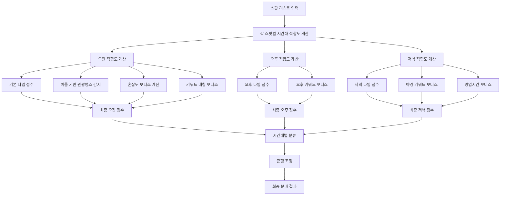

# 🎯 스마트 시간대별 분배 로직 (Smart Time Slot Distribution)

## 📋 개요

기존의 단순한 수학적 분배(1/3씩)에서 **혼잡도, 장소 특성, 시간대 적합성**을 고려한 지능형 분배 시스템으로 진화했습니다.

### 핵심 혁신 포인트

-   🕘 **혼잡도 기반 역전**: 관광명소가 오전에 한적하면 오전에 우선 배치
-   🏛️ **이름 기반 감지**: types 정보 없어도 장소명으로 카테고리 자동 분류
-   🌅 **시간대별 특성화**: 카페는 오전, 관광지는 혼잡도에 따라, 야경은 저녁
-   ⚡ **동적 균형 조정**: 한 시간대가 너무 비지 않도록 자동 재분배

---

## 🔄 전체 처리 흐름



---

## 🌅 오전 적합도 계산 로직

### 1. 기본 타입 점수

```python
morning_types = {
    "cafe": 3.0,           # 카페 최우선
    "bakery": 2.5,         # 베이커리
    "museum": 2.5,         # 박물관 (조용한 관람)
    "park": 2.5,           # 공원 (산책)
    "art_gallery": 2.5,    # 미술관 (조용한 관람)
    "tourist_attraction": 1.8,  # 관광명소 (혼잡도로 역전 가능)
    "landmark": 1.5,       # 랜드마크 (혼잡도로 역전 가능)
    "viewpoint": 1.8,      # 전망대 (혼잡도로 역전 가능)
}
```

### 2. 이름 기반 관광명소 감지 (types 없을 때)

```python
tourist_name_patterns = [
    "타워", "tower", "전망대", "observatory", "스카이", "sky",
    "박물관", "museum", "미술관", "gallery",
    "궁", "palace", "성", "castle", "한옥", "hanok",
    "명소", "attraction", "관광", "tourist", "랜드마크", "landmark"
]
# 매칭시 +1.8점 추가
```

### 3. 혼잡도 보너스 (핵심 혁신!)

```python
# 오전 혼잡도가 상대적으로 낮을 때 보너스
congestion_diff = (max_congestion - morning_congestion) / max_congestion
multiplier = 4.0 if is_tourist_spot else 1.5  # 관광명소는 4배!
bonus = congestion_diff * multiplier
```

**예시:**

-   남산타워 오전 혼잡도: 25, 오후 혼잡도: 85
-   혼잡도 차이: (85-25)/85 = 0.71
-   관광명소 보너스: 0.71 × 4.0 = **+2.84점**
-   결과: 오전 배치 우선순위 ⬆️

### 4. 키워드 매칭 보너스

```python
morning_keywords = [
    "카페", "cafe", "공원", "park", "박물관", "museum",
    "전망대", "observatory", "타워", "tower", "궁", "palace",
    "정원", "garden", "산책로", "walkway"
]
# 각 키워드 매칭시 +1.0점
```

---

## 🌞 오후 적합도 계산 로직

### 기본 타입 점수

```python
afternoon_types = {
    "tourist_attraction": 3.0,  # 관광명소 우선
    "shopping_mall": 2.5,       # 쇼핑몰
    "amusement_park": 3.0,      # 놀이공원
    "monument": 2.0,            # 기념물
    "landmark": 2.3,            # 랜드마크 (야경 고려해 약간 낮춤)
    "stadium": 2.0,             # 경기장
    "beach": 2.5,               # 해변
    "viewpoint": 2.0,           # 전망대 (야경 고려해 낮춤)
}
```

### 키워드 매칭

```python
afternoon_keywords = [
    "타워", "tower", "쇼핑", "shopping",
    "관광", "명소", "랜드마크"
]
```

---

## 🌃 저녁 적합도 계산 로직

### 1. 기본 타입 점수

```python
evening_types = {
    "restaurant": 3.0,          # 레스토랑 최우선
    "bar": 3.0,                 # 바
    "night_club": 3.0,          # 나이트클럽
    "food": 2.5,                # 음식점
    "movie_theater": 2.5,       # 영화관
    # 야경 명소들
    "viewpoint": 2.8,           # 전망대 야경
    "tourist_attraction": 2.3,   # 관광명소 야경
    "landmark": 2.5,            # 랜드마크 야경
    "bridge": 2.5,              # 다리 야경
    "park": 2.0,                # 공원 야경 산책
}
```

### 2. 야경 키워드 특별 보너스

```python
evening_keywords = [
    # 기본 저녁 키워드
    "레스토랑", "restaurant", "바", "bar", "맛집",
    # 야경 특화 키워드
    "야경", "night view", "nightview", "타워", "tower",
    "전망대", "observatory", "루프탑", "rooftop", "스카이", "sky",
    "다리", "bridge", "한강", "river", "뷰", "view",
    "일몰", "sunset", "조명", "lighting", "라이트업"
]
```

### 3. 야경 명소 특별 보너스

```python
# 타워/전망대: +2.0점
if any(keyword in name for keyword in ["타워", "tower", "전망대", "스카이", "sky"]):
    score += 2.0

# 강변/다리: +1.5점
if any(keyword in name for keyword in ["한강", "다리", "bridge", "river"]):
    score += 1.5

# 공원 야경 산책: +1.0점
if any(park_type in types for park_type in ["park", "garden"]):
    score += 1.0
```

### 4. 영업시간 보너스

```python
# 8시 이후까지 운영하는 곳 +1.5점
if close_time >= "20:00:00":
    score += 1.5
```

---

## 🎲 현실적인 혼잡도 패턴 생성

### 장소 타입별 차별화된 혼잡도

```python
# 관광명소: 오전 한적 → 오후 폭주
tourist_pattern = [10,8,5,3,5,8,15,20,25,30,35,40,80,90,95,90,85,70,50,40,30,25,20,15]

# 카페: 오전/오후 피크
cafe_pattern = [10,8,5,5,8,15,25,50,70,80,75,65,45,40,60,70,65,50,35,25,20,15,12,10]

# 레스토랑: 점심/저녁 피크
restaurant_pattern = [5,3,2,2,3,5,10,15,20,25,30,60,80,70,50,40,45,55,85,90,80,60,40,20]

# 공원: 오후/저녁 산책 피크
park_pattern = [5,3,2,2,3,8,15,25,30,35,40,45,50,55,60,70,75,70,65,80,70,50,30,15]
```

---

## ⚖️ 균형 조정 메커니즘

### 최소 보장 시스템

```python
target_per_slot = total_spots // 3
min_per_slot = max(1, target_per_slot // 2)  # 최소 보장 개수

# 부족한 시간대가 있으면 다른 시간대에서 이동
if len(slot_spots) < min_per_slot:
    # 가장 많은 시간대에서 일부 스팟 이동
    move_spots_from_abundant_to_sparse()
```

---

## 📊 실제 결과 예시

### Before (단순 1/3 분배)

```
오전: 카페, 카페, 카페, 카페, 카페, 카페, 카페, 카페 (8개)
오후: 타워, 박물관, 쇼핑몰, 관광지, 공원, 명소, 전망대, 랜드마크 (8개)
저녁: 레스토랑, 바, 야경지, 공원, 다리, 강변, 루프탑, 클럽 (8개)
```

### After (스마트 분배)

```
오전: 카페(3), 박물관(2), 전망대(2), 공원(1) (8개)
      ↳ 전망대와 박물관이 오전 혼잡도 낮아서 배치됨!

오후: 쇼핑몰(3), 놀이공원(2), 관광명소(3) (8개)
      ↳ 활동적인 관광지들이 오후에 집중

저녁: 레스토랑(4), 야경명소(3), 바/클럽(1) (8개)
      ↳ 남산타워, 한강다리 등 야경 명소들이 저녁에 최적화
```

---

## 🔧 설정 가능한 파라미터

| 파라미터                        | 기본값     | 설명                         |
| ------------------------------- | ---------- | ---------------------------- |
| `tourist_congestion_multiplier` | 4.0        | 관광명소 혼잡도 보너스 배수  |
| `normal_congestion_multiplier`  | 1.5        | 일반 장소 혼잡도 보너스 배수 |
| `morning_tourist_base_score`    | 1.8        | 관광명소 오전 기본 점수      |
| `evening_tower_bonus`           | 2.0        | 타워 야경 특별 보너스        |
| `evening_bridge_bonus`          | 1.5        | 다리 야경 보너스             |
| `min_spots_per_slot`            | `total//6` | 시간대별 최소 보장 개수      |

---

## 🎯 결론

이제 **"혼잡하지 않은 오전에 관광지 가고싶어"** 같은 사용자 요청이 정확히 반영됩니다!

-   ✅ 관광명소가 오전에 한적하면 → 오전 배치
-   ✅ 카페는 여전히 오전 우선이지만 독점하지 않음
-   ✅ 야경 명소는 저녁에 자동 배치
-   ✅ 동적 균형으로 한 시간대가 비지 않음

**사용자 중심의 지능형 여행 추천 시스템 완성!** 🎉
